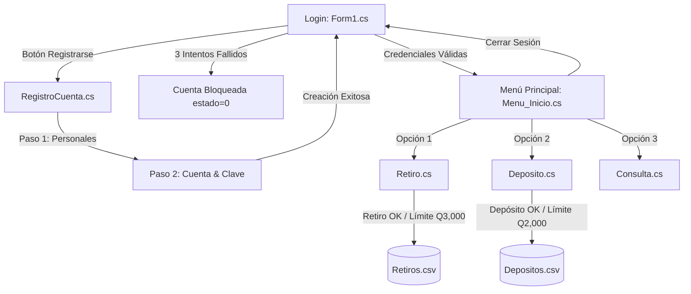

# 🏧 Cajero Automático (ATM) en C# .NET & SQL Server

<div align="center">

[](https://docs.microsoft.com/en-us/dotnet/csharp/)
[](https://dotnet.microsoft.com/)
[](https://docs.microsoft.com/en-us/dotnet/desktop/winforms/)
[](https://www.microsoft.com/sql-server)
[](LICENSE)

<br/>

**Aplicación de escritorio desarrollada en C# WinForms conectada a SQL Server para simulación bancaria completa, control de transacciones en quetzales (GTQ), validaciones de seguridad y auditoría en CSV.**

<br/>

[🚀 **Probar Simulador y Preview en Vivo**](https://ais-pre-yp2ksa6mdvdeieuctagcdp-651500077203.us-east1.run.app) &nbsp;&bull;&nbsp; [📖 **Documentación**](#-arquitectura-y-módulos) &nbsp;&bull;&nbsp; [🛠️ **Instalación**](#-instalación-y-configuración) &nbsp;&bull;&nbsp; [🗄️ **Base de Datos**](#-esquema-de-base-de-datos)

<br/>

<!-- PREVIEW BANNER -->


</div>

---

## 🌟 Características Principales

- **🔐 Autenticación y Control de Intentos**:
  - Validación con triple factor: **Código de Cliente**, **Nombre de Usuario** y **Contraseña**.
  - Contador de seguridad con **máximo 3 intentos erróneos**.
  - **Bloqueo automático de cuenta** en la base de datos al superar el límite de intentos.

- **💵 Retiro de Efectivo en Quetzales (GTQ)**:
  - Botones rápidos de retiro: `Q50.00`, `Q100.00`, `Q200.00`, `Q400.00`, `Q600.00` y `Q1000.00`.
  - Opción de **monto personalizado** (requiere estrictamente múltiplos de Q50).
  - Verificación de saldo disponible y cálculo de cambio.
  - **Límite diario acumulativo de retiros:** Máximo **Q3,000.00 por día**.

- **📥 Depósitos a Cuentas**:
  - **Depósito a cuenta propia**: límite de hasta Q100,000.00 por transacción.
  - **Depósito a cuentas de terceros**: comprobación previa de código, usuario y estado activo de la cuenta receptora.
  - **Límite diario de transferencias/depósitos a terceros:** Máximo **Q2,000.00 por día**.

- **👤 Registro de Clientes Nuevos**:
  - Registro guiado en 2 etapas: Datos Personales y Credenciales Bancarias.
  - Validaciones con expresiones regulares (`Regex`):
    - Nombre y Apellido (únicamente letras).
    - Fecha de nacimiento (validación de formatos de calendario y años 1900–2005).
    - Teléfono guatemalteco de 8 dígitos numéricos (comprobación de unicidad).
    - DPI guatemalteco de 10 a 15 dígitos (comprobación de no duplicidad).
    - Correo electrónico con estructura válida.
    - Contraseña robusta (mínimo 6 caracteres, al menos un número, caracter especial, al menos una mayúscula pero **no al inicio**, y sin incluir el usuario).
    - Depósito de apertura mínimo de **Q100.00**.

- **📊 Auditoría y Registro en CSV**:
  - `Retiros.csv`: guarda automáticamente `Codigo;Nombre;Apellido;Monto Retirado;Fecha`.
  - `Depositos.csv`: guarda `CodigoDepositante;UsuarioDepositante;CodigoReceptor;UsuarioReceptor;Monto;Fecha`.

- **🗄️ Persistencia con LINQ to SQL**:
  - Mapeo relacional con `RegistroDataContext` (`Registro.dbml`) sobre Microsoft SQL Server.

---

## 🖥️ Demostración y Preview en GitHub

Puedes probar la versión simulada interactiva directamente en la web sin compilar:

👉 **[Abrir Demo Interactivo de Cajero Automático](https://ais-pre-yp2ksa6mdvdeieuctagcdp-651500077203.us-east1.run.app)**

La web incluye:
1. **Simulador de cajero completo** con las reglas idénticas al código de C#.
2. **Generador y visor del archivo README.md** para el repositorio.
3. **Descargador de los archivos de base de datos (`SQLQueryProyecto.sql`) y logs CSV**.
4. **Editor de base de datos** para añadir y probar usuarios.

---

## 👥 Cuentas de Prueba Preconfiguradas

Al ejecutar el script de base de datos se generan los siguientes usuarios iniciales:

| Código | Usuario | Contraseña | DPI | Banco | Saldo Inicial | Estado |
| :---: | :--- | :--- | :---: | :--- | :---: | :---: |
| **1000** | `eduardofujeje` | `ciscO@123` | `3023043040101` | Industrial | **Q 150.00** | ✅ Activo |
| **1001** | `daniellajeje` | `ciscO@123` | `3021675360101` | Banrural | **Q 1,500.00** | ✅ Activo |
| **1002** | `laloooo1` | `andreA@145` | `3021051570101` | Industrial | **Q 10,000.00** | ❌ Bloqueado |

---

## 🏛️ Arquitectura y Módulos

```
Cajero/
├── Cajero.sln                      # Archivo de solución de Visual Studio
├── SQLQueryProyecto.sql            # Script DDL y DML para Microsoft SQL Server
└── Cajero/
    ├── App.config                  # Cadenas de conexión (ConnectionStrings)
    ├── Program.cs                  # Punto de entrada de la aplicación
    ├── Form1.cs / Form1.Designer.cs           # Pantalla de Login y autenticación
    ├── Menu_Inicio.cs / .Designer.cs          # Dashboard principal de opciones
    ├── Consulta.cs / .Designer.cs             # Consulta de saldo y detalle DataGrid
    ├── Retiro.cs / .Designer.cs               # Retiros, selección y verificación diaria
    ├── Deposito.cs / .Designer.cs             # Depósitos propios y a terceros
    ├── RegistroCuenta.cs / .Designer.cs       # Registro y validaciones Regex
    ├── Registro.dbml / .designer.cs           # Mapeo ORM LINQ to SQL
    ├── Imagenes/                              # Fondos y logotipos de la UI
    └── Transacciones/                         # Almacenamiento local de archivos CSV
```

### Flujo de Navegación



---

## 🗄️ Esquema de Base de Datos

El script SQL se encuentra en `Cajero/SQLQueryProyecto.sql`. Crea la base de datos `registro` y la tabla `clientes`:

```sql
CREATE DATABASE registro;
USE registro;

CREATE TABLE clientes(
    codigo INT PRIMARY KEY IDENTITY(1000,1),
    nombre VARCHAR(30),
    apellido VARCHAR(30),
    fecha_de_nacimiento VARCHAR(30),
    DPI BIGINT,
    correo VARCHAR(50),
    telefono BIGINT,
    usuario VARCHAR(30),
    contraseña VARCHAR(30),
    banco VARCHAR(15),
    monto INT,
    estado BIT
);
```

---

## 🛠️ Instalación y Configuración

### 1. Requisitos Previos
- **Sistema Operativo**: Windows 10 / Windows 11.
- **Entorno de Desarrollo**: [Visual Studio 2019 o 2022](https://visualstudio.microsoft.com/) con la carga de trabajo **Desarrollo de escritorio de .NET**.
- **Versión del Framework**: .NET Framework 4.8.
- **Motor de Base de Datos**: [Microsoft SQL Server Express](https://www.microsoft.com/es-es/sql-server/sql-server-downloads) y [SQL Server Management Studio (SSMS)](https://learn.microsoft.com/es-es/sql/ssms/download-sql-server-management-studio-ssms).

### 2. Pasos de Instalación

1. **Clonar el repositorio**:
   ```bash
   git clone https://github.com/Eduardo-Fu/Cajero.git
   cd Cajero
   ```

2. **Crear la Base de Datos**:
   - Abre SQL Server Management Studio (SSMS).
   - Conéctate a tu instancia local (`localhost\SQLEXPRESS` o tu nombre de equipo).
   - Abre y ejecuta el archivo `Cajero/SQLQueryProyecto.sql`.

3. **Configurar la Cadena de Conexión en `App.config`**:
   Abre el archivo `Cajero/Cajero/App.config` y ajusta el `Data Source` con el nombre de tu servidor:
   ```xml
   <connectionStrings>
       <add name="Cajero.Properties.Settings.registroConnectionString"
            connectionString="Data Source=TU_SERVIDOR\SQLEXPRESS;Initial Catalog=registro;Integrated Security=True"
            providerName="System.Data.SqlClient" />
   </connectionStrings>
   ```

4. **Compilar y Ejecutar**:
   - Abre `Cajero/Cajero.sln` con Visual Studio.
   - Presiona `F5` o haz clic en **Iniciar** en modo `Debug` o `Release`.

---

## 📝 Auditoría de Archivos CSV

La aplicación almacena automáticamente cada movimiento en el directorio `Transacciones/`:

### Formato `Retiros.csv`:
```csv
Codigo;Nombre;Apellido;Monto Retirado;Fecha
1000;Eduardo;Fu;200;06/10/2026
```

### Formato `Depositos.csv`:
```csv
CodigoDepositante;UsuarioDepositante;CodigoReceptor;UsuarioReceptor;Monto;Fecha
1000;eduardofujeje;1001;daniellajeje;500;06/10/2026
```

---

## 👨‍💻 Autor

- **Eduardo Fu** - [GitHub @Eduardo-Fu](https://github.com/Eduardo-Fu)

---

## 📄 Licencia

Este proyecto está bajo la Licencia **MIT** - consulta el archivo [LICENSE](LICENSE) para más detalles.
